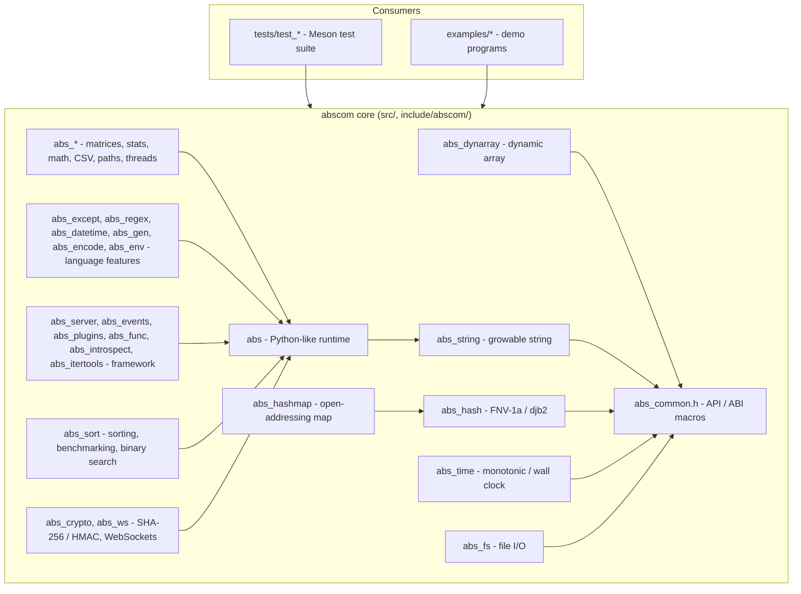

<p align="center">
  
</p>

<h1 align="center">Abscom</h1>

<p align="center">
  A C11 library of reusable data structures and platform utilities, plus a Python-inspired dynamic runtime for scripting-style C programs.
</p>

## Badges

<p align="center">
  
  
  
  
  
  
</p>

## Overview

Abscom bundles low-level building blocks — dynamic arrays, growable strings, hash functions, an open-addressing hash map, timing helpers, and simple file I/O — under a single umbrella header. On top of that it ships a Python-inspired dynamic runtime that brings `var` values, lists, dictionaries, sets, JSON, random utilities, and a light object system to plain C, plus a scientific layer with matrices, statistics, advanced math, CSV, path helpers, and basic threading. A language-features layer adds exceptions (`try`/`catch`), context managers (`with`), regex, date/time, generators, base64/UUID, and environment variables. A framework layer tops it off with a micro web server, an event emitter, dynamic plugins, function objects with memoization and decorators, introspection, and itertools-style iterators. An algorithm suite rounds it out with twelve sorting algorithms, a swap-hook visualizer, `timeit` benchmarking, and binary search. A realtime-and-crypto layer adds RFC 6455 WebSockets (handshake and framing) plus from-scratch SHA-256 and HMAC-SHA-256. The library has no dependencies beyond the C standard library (plus Winsock on Windows) and is built and tested with Meson.

## Screenshots

<p align="center">
  
</p>

<p align="center">
  <em>Quick start — the dynamic runtime in a few lines of C.</em>
</p>

<table align="center">
  <tr>
    <td align="center"><br><em>Dynamic runtime</em></td>
    <td align="center"><br><em>Core modules</em></td>
    <td align="center"><br><em>Example program</em></td>
  </tr>
</table>

<p align="center">
  <em>More:
    <a href="docs/screenshots.md">View all screenshots</a>
  </em>
</p>

## Table of Contents

- [Key Features](#key-features)
- [Installation](#installation)
- [Quick Start](#quick-start)
- [Usage Examples](#usage-examples)
- [Documentation](#documentation)
- [Interface](#interface)
- [Architecture](#architecture)
- [Requirements](#requirements)
- [Prerequisites](#prerequisites)
- [Development](#development)
- [Contributing](#contributing)
- [Security](#security)
- [License](#license)

## Key Features

- **Zero-dependency C11 library** — only the standard library, plus `ws2_32` on Windows for `http_get`.
- **Data structures** — dynamic array (`abs_dynarray`), growable string (`abs_string`), and an open-addressing, string-keyed hash map (`abs_hashmap`) with tombstone deletion and automatic resizing.
- **Hashing** — FNV-1a 32/64-bit and djb2 hash functions (`abs_hash`).
- **Platform helpers** — monotonic/wall-clock time (`abs_time`) and file existence/read/write/remove/rename (`abs_fs`).
- **Python-inspired runtime** — `var` objects created with the `v()` literal macro, plus `None` / `True` / `False`.
- **Containers** — lists, dictionaries, and deduplicating sets with union/difference/contains operations.
- **Strings** — split/join, strip, case conversion, `startswith`/`endswith`, and `count`.
- **JSON** — `json_parse` (objects, arrays, numbers, booleans, null, nested values) and `json_dump` with full escaping.
- **Functional helpers** — `map_func`, `filter_func`, and `list_comp` (map + filter in one pass).
- **Random utilities** — `randint`, `random_float`, `uniform`, `choice`, `choices`, `sample`, `shuffle`, and seeded/`seed()` sequences.
- **Aggregates & math** — `min_val`, `max_val`, `sum_val`, `abs_val`, `pow_val`, `round_val`.
- **Sequences** — `sorted` (ascending/descending), `reversed_seq`, `zip_lists`, `slice`, and `range`/`range_step`.
- **OOP-lite** — `Class` / `New` / `set_attr` / `get_attr` for lightweight class-and-instance objects.
- **System helpers** — `sleep_sec`, `time_now`, `exec_cmd`, and an HTTP/1.0 `http_get`.
- **Matrices** — `abs_matrix_*` constructors, get/set, multiplication, transpose, determinant, and printing.
- **Statistics** — `mean`, `median`, `mode`, population `variance`, and population `stdev`.
- **Advanced math** — `sin_val`, `cos_val`, `tan_val`, `log_val`, `log10_val`, `sqrt_val`, `deg2rad`.
- **Combinatorics** — `factorial`, `nCr`, `nPr`.
- **Paths & OS helpers** — `path_join`, `path_exists`, `getcwd_val`.
- **CSV** — `csv_read` and `csv_write`.
- **Threading** — `thread_start` / `thread_join` with a lock-guarded object pool for safe allocation from worker threads.
- **Exceptions** — `try` / `catch` / `end_try` + `throw`, with `with(VAR, INIT)` context managers and `close_resource` for automatic cleanup.
- **Regex** — `re_match`, `re_findall`, and `re_sub` with `.` / `*` / `^` / `$` support.
- **Date & time** — `datetime_now`, `strftime_val`, and `timedelta`.
- **Generators** — lazy `range_gen` / `next` sequences.
- **Encoding & env** — `base64_encode`, version-4 `uuid4`, and `os_getenv` / `os_setenv`.
- **Web server** — `Server` / `route` / `server_run` micro HTTP server plus a socket-free `server_handle` dispatcher for testing.
- **Events** — `EventBus` / `on` / `emit` publish-subscribe with per-event handler lists.
- **Plugins** — `load_library` / `call_lib_func` dynamic library loading (`LoadLibrary` / `dlopen`).
- **Function objects** — `make_func`, `call_func`, `memoize` / `call_memoized` caching, and `decorate` / `func_meta` decorators.
- **Introspection** — `id`, `repr`, and `dir` for object identity, debugging, and key listing.
- **Itertools** — lazy `chain` and `cycle` iterators with `iter_next`.
- **Sorting suite** — twelve algorithms from `O(n²)` (bubble, selection, insertion) to `O(n log n)` (shell, heap, merge, quick, C `qsort`) and `O(n)` integer sorts (counting, radix, bucket), plus the joke `sort_bogo`.
- **Visualizer** — `sort_bubble_visual` calls an `AbsSortVis` hook on every swap for logs or animations.
- **Benchmarking** — `timeit` times any sort on a deep-copied list without touching the original.
- **Search** — `binary_search` for sorted lists, plus `is_sorted` and `list_copy` helpers.
- **WebSockets** — RFC 6455 `ws_accept` handshake (real SHA-1), `ws_send` / `ws_recv` text framing, and public `ws_compute_accept` / `ws_encode_frame` / `ws_decode_frame` helpers for testing the wire format socket-free.
- **Cryptography** — from-scratch `sha256` and `hmac_sha256` (FIPS 180-4 / RFC 2104), pinned to known-answer test vectors.
- **More shuffling** — `fisher_yates` (the classic name for `shuffle`) and a card-deck `riffle_shuffle` that cuts and interleaves the list.
- **Iterators** — `chain`, `cycle`, and `repeat` consumed via `iter_next`.
- **One umbrella header** — `abscom/abs.h` exposes the core modules and the dynamic runtime.

## Installation

### One-line installer

The quickest way to install Abscom is the one-line installer. It downloads a prebuilt release asset for your platform (from the automatic release pipeline) and installs the headers, libraries, and pkg-config file to a prefix — no compiler needed. When no matching prebuilt asset is available it falls back to downloading the source and building it with Meson (or a direct `cc`/`gcc` compile). The same script uninstalls everything it placed.

Windows (PowerShell):

```powershell
irm https://raw.githubusercontent.com/rkriad585/Abscom/main/installer.ps1 | iex
```

Linux and macOS:

```sh
curl -fsSL https://raw.githubusercontent.com/rkriad585/Abscom/main/installer.sh | sh
```

Uninstall with the same command plus the uninstall flag:

```powershell
(Invoke-RestMethod https://raw.githubusercontent.com/rkriad585/Abscom/main/installer.ps1) + " -SelfUninstall" | iex
```

```sh
curl -fsSL https://raw.githubusercontent.com/rkriad585/Abscom/main/installer.sh | sh -s -- --selfuninstall
```

Pass `-Prefix <dir>` (PowerShell) or `--prefix <dir>` (Unix) to install to another location, and `-ForceDirect` / `--force-direct` to skip Meson. See [docs/installation.md](docs/installation.md) for options.

### Build from source

Requires a C11 compiler, [Meson](https://mesonbuild.com/), and [Ninja](https://ninja-build.org/).

```sh
git clone https://github.com/rkriad585/Abscom.git
cd Abscom
./build.sh                          # configure, build, and run the tests
./build.sh --install --prefix "$HOME/.local"
```

On Windows:

```powershell
git clone https://github.com/rkriad585/Abscom.git
cd Abscom
.\build.ps1
.\build.ps1 -Install -Prefix "$HOME\abscom"
```

The raw Meson commands work too: `meson setup build`, `meson compile -C build`, `meson test -C build`, and `meson install -C build`. On Windows the build automatically links the Winsock library (`ws2_32`) that `http_get` needs; no manual steps are required.

### Linking

Compile against the installed library, or let pkg-config supply the flags:

```sh
export PKG_CONFIG_PATH=<prefix>/lib/pkgconfig
cc -std=c11 hello.c $(pkg-config --cflags --libs abscom) -o hello
```

See [docs/installation.md](docs/installation.md) for platform notes.

## Quick Start

Save the following as `hello.c`:

```c
#include "abscom/abs.h"

int main(void) {
    abs_init();

    var nums = List();
    append(nums, v(10));
    append(nums, v(20));
    append(nums, v(30));
    print(v("Sum:"), sum_val(nums));

    var user = Dict();
    dset(user, "name", v("Alice"));
    print(v("Name:"), dget(user, "name"));

    abs_cleanup();
    return 0;
}
```

Build and run it against the static library:

```sh
cc -std=c11 hello.c -Iinclude build/libabscom.a -o hello
./hello
```

On Windows, add `-lws2_32`. If you installed Abscom with the installer instead of building it, use pkg-config (see [Installation](#installation)). Expected output:

```
Sum: 60
Name: Alice
```

See [docs/getting-started.md](docs/getting-started.md) for a longer walkthrough.

## Usage Examples

### Sets, `foreach`, and list comprehension

```c
var s = Set();
set_add(s, v(3));
set_add(s, v(1));
set_add(s, v(3));          /* duplicate, ignored */
print(v("Set:"), s);       /* {3, 1} */

var item;
long total = 0;
foreach (item, range(0, 10)) total += item->val.i;
print(v("foreach sum:"), abs_new_int(total));   /* 45 */

/* square_it and is_odd_b are user callbacks (see examples/v6_demo.c) */
print(v("Squares:"), list_comp(range(0, 10), square_it, is_odd_b));
```

### JSON round-trip

```c
var data = json_parse("{\"id\": 101, \"scores\": [10, 20, 30]}");
print(v("ID:"), dget(data, "id"));

var out = json_dump(data);
print(out);                 /* {"id": 101, "scores": [10, 20, 30]} */
```

### OOP-lite

```c
var Dog = Class("Dog");
var rex = New(Dog);
set_attr(rex, "name", v("Rex"));
print(v("Name:"), get_attr(rex, "name"));   /* Rex */
```

### HTTP/1.0 GET

```c
var html = http_get("http://example.com/");
if (is_err(html)) {
    print(v("HTTP error:"), html);
} else {
    print(v("Body length:"), len(html));
}
```

### Matrices and statistics

```c
var A = abs_matrix_new(2, 2);
abs_matrix_set(A, 0, 0, 1.0); abs_matrix_set(A, 0, 1, 2.0);
abs_matrix_set(A, 1, 0, 3.0); abs_matrix_set(A, 1, 1, 4.0);
print(v("det(A):"), abs_matrix_det(A));   /* -2.00 */

var data = List();
append(data, v(10)); append(data, v(20));
append(data, v(20)); append(data, v(40));
print(v("mean:"), abs_stats_mean(data));  /* 22.50 */
print(v("stdev:"), abs_stats_stdev(data));/* 10.90 */
```

### Exceptions, regex, and generators

```c
var g = range_gen(0, 6, 2);
var n;
while ((n = next(g)) != NULL && !is_none(n)) print(n);   /* 0 2 4 */

print(re_sub(v("o"), v("0"), v("hello")));               /* hell0 */

var result = None;
try {
    if (1 < 0) throw("impossible");
    result = v(42);
}
catch (result) { print(v("Caught:"), result); }
end_try;
print(v("Result:"), result);                             /* 42 */
```

### Web server, events, memoization, and iterators

```c
static var api_home(var req) { (void)req; return v("<h1>Home</h1>"); }

var app = Server(0);                     /* ephemeral port */
route(app, "/", api_home);
print(server_handle(app, "GET / HTTP/1.1"));   /* <h1>Home</h1> */
/* server_run(app);                      /* blocking HTTP server */

var bus = EventBus();
on(bus, "login", my_login_handler);
emit(bus, "login", v("Alice"));

var f = memoize(heavy_calc);             /* cached calls */
print(call_memoized(f, v(5)));

var c = chain(List(), List());           /* itertools */
print(iter_next(c));                     /* None once exhausted */
```

### Sorting, benchmarking, and binary search

```c
static void on_swap(var list, int idx_a, int idx_b) {
    (void)idx_a; (void)idx_b;
    print(list);                         /* log every step */
}

var data = List();
for (int i = 0; i < 100; i++) append(data, v(rand() % 1000));

print(v("bubble took:"), v(timeit(sort_bubble, data)), v("sec"));

var small = List();
append(small, v(50)); append(small, v(10)); append(small, v(40));
sort_bubble_visual(small, on_swap);      /* [10, 40, 50] */

sort_quick(data);                        /* in place */
print(v("Found at index:"), v(binary_search(data, v(500))));
```

### WebSockets, hashing, and iterators

```c
var h = sha256("password");              /* 5e884898... */
print(h);
print(hmac_sha256("secret", "message"));

print(ws_compute_accept("dGhlIHNhbXBsZSBub25jZQ=="));   /* s3pPLMBiTxaQ9kYGzzhZRbK+xOo= */

char frame[32], out[32];
size_t n = ws_encode_frame(frame, sizeof(frame), "Hello"); /* 81 05 48 65 6c 6c 6f */
long len = ws_decode_frame(frame, n, out, sizeof(out));    /* 5 */

var deck = range(0, 13);
riffle_shuffle(deck);                    /* cut and interleave */
fisher_yates(deck);                      /* full randomization */

var rep = repeat(v("beep"), 3);          /* repeat() iterator */
print(iter_next(rep));                   /* beep */
```

More examples live in the `examples/` directory (`demo.c`, `py_demo.c`, `data_demo.c`, `v6_demo.c`, `sci_demo.c`, `lang_demo.c`, `framework_demo.c`, `sort_demo.c`, `crypto_demo.c`) and are built as `build/examples/<name>`.

## Documentation

| Document | Description |
| --- | --- |
| [docs/getting-started.md](docs/getting-started.md) | First steps, prerequisites, and a walkthrough. |
| [docs/installation.md](docs/installation.md) | Building, linking, and installing Abscom. |
| [docs/architecture.md](docs/architecture.md) | Module layout and how the pieces fit together. |
| [docs/configuration.md](docs/configuration.md) | Build-time options and the (empty) runtime config story. |
| [docs/development.md](docs/development.md) | Building, testing, and releasing. |
| [docs/deployment.md](docs/deployment.md) | Vendoring, installation layout, and distribution. |
| [docs/screenshots.md](docs/screenshots.md) | Screenshot index. |
| [docs/faq.md](docs/faq.md) | Frequently asked questions. |
| [docs/troubleshooting.md](docs/troubleshooting.md) | Common build and runtime problems. |

### Core library

| Document | Description |
| --- | --- |
| [common-macros.md](docs/common-macros.md) | `ABS_API`, C++ interop, and `ABS_UNUSED`. |
| [dynamic-arrays.md](docs/dynamic-arrays.md) | `abs_dynarray` — generic dynamic array. |
| [strings.md](docs/strings.md) | `abs_string` — growable NUL-terminated string. |
| [hashing.md](docs/hashing.md) | `abs_hash` — FNV-1a and djb2. |
| [hash-maps.md](docs/hash-maps.md) | `abs_hashmap` — open-addressing string-keyed map. |
| [time.md](docs/time.md) | `abs_time` — monotonic and wall-clock timers. |
| [file-io.md](docs/file-io.md) | `abs_fs` — file existence, read/write, remove, rename. |

### Runtime

| Document | Description |
| --- | --- |
| [lifecycle.md](docs/lifecycle.md) | `abs_init`, `abs_cleanup`, `del`, and the memory pool. |
| [literals-and-constructors.md](docs/literals-and-constructors.md) | `v()`, `None`/`True`/`False`, `List`/`Dict`/`Set`. |
| [types-and-conversions.md](docs/types-and-conversions.md) | `AbsType`, `type()`, `is_*`, `to_str`/`to_int`/`to_float`. |
| [lists-and-ranges.md](docs/lists-and-ranges.md) | `append`, `get`, `len`, `range`, `range_step`, `slice`. |
| [loops.md](docs/loops.md) | The `foreach` macro. |
| [dictionaries.md](docs/dictionaries.md) | `dset`/`dget` and keyed lookups. |
| [sets.md](docs/sets.md) | `set_add`, `set_contains`, `set_union`, `set_diff`. |
| [string-methods.md](docs/string-methods.md) | `upper`/`lower`, `split`/`join`, `strip`, `startswith`/`endswith`, `count`. |
| [formatting.md](docs/formatting.md) | `print`, `print_end`, `fmt`, `input`, and stringification. |
| [json.md](docs/json.md) | `json_parse` and `json_dump`. |
| [functional-helpers.md](docs/functional-helpers.md) | `map_func`, `filter_func`, `list_comp`. |
| [random-utilities.md](docs/random-utilities.md) | `seed`, `randint`, `choice`, `sample`, `shuffle`, and more. |
| [math-and-aggregates.md](docs/math-and-aggregates.md) | `min_val`/`max_val`/`sum_val`, `abs_val`, `pow_val`, `round_val`. |
| [truthiness-and-logic.md](docs/truthiness-and-logic.md) | `is_true`, `not_`, `any`, `all`, `eq`. |
| [sequences-and-sorting.md](docs/sequences-and-sorting.md) | `sorted`, `reversed_seq`, `zip_lists`. |
| [oop-lite.md](docs/oop-lite.md) | `Class` / `New` / `set_attr` / `get_attr`. |
| [runtime-files.md](docs/runtime-files.md) | `fopen_safe`, `read_file`, `write_file`, `close_file`. |
| [system.md](docs/system.md) | `sleep_sec`, `time_now`, `exec_cmd`, `http_get`. |
| [error-handling.md](docs/error-handling.md) | `abs_new_error`, `is_err`, and failure behavior. |

### Scientific layer

| Document | Description |
| --- | --- |
| [scientific.md](docs/scientific.md) | Matrices, statistics, advanced math, combinatorics, paths, CSV, and threading. |

### Language features

| Document | Description |
| --- | --- |
| [exceptions.md](docs/exceptions.md) | `try`/`catch`/`end_try`, `throw`, and `with` context managers. |
| [regex.md](docs/regex.md) | `re_match`, `re_findall`, and `re_sub`. |
| [datetime.md](docs/datetime.md) | `datetime_now`, `strftime_val`, and `timedelta`. |
| [generators.md](docs/generators.md) | `range_gen` and `next`. |
| [encoding-and-env.md](docs/encoding-and-env.md) | `base64_encode`, `uuid4`, `os_getenv`, and `os_setenv`. |

### Framework

| Document | Description |
| --- | --- |
| [web-server.md](docs/web-server.md) | `Server`, `route`, `server_handle`, and `server_run`. |
| [events.md](docs/events.md) | `EventBus`, `on`, and `emit`. |
| [plugins.md](docs/plugins.md) | `load_library` and `call_lib_func`. |
| [functions.md](docs/functions.md) | `make_func`, `call_func`, `memoize`, `decorate`, and `func_meta`. |
| [introspection.md](docs/introspection.md) | `id`, `repr`, and `dir`. |
| [itertools.md](docs/itertools.md) | `chain`, `cycle`, and `iter_next`. |

### Algorithm suite

| Document | Description |
| --- | --- |
| [sorting.md](docs/sorting.md) | Twelve sorting algorithms, `sort_bubble_visual`, `timeit`, and `binary_search`. |

### Realtime & crypto

| Document | Description |
| --- | --- |
| [websockets.md](docs/websockets.md) | RFC 6455 `ws_accept`, `ws_send`, `ws_recv`, and the framing helpers. |
| [crypto.md](docs/crypto.md) | `sha256` and `hmac_sha256` (FIPS 180-4 / RFC 2104). |

## Interface

- **Core library** — include `<abscom/abs.h>` to get `abs_dynarray`, `abs_string`, `abs_hash`, `abs_hashmap`, `abs_time`, and `abs_fs` in one header.
- **Dynamic runtime** — include `<abscom/abs.h>` for the Python-inspired `var` API.
- **ABI/export macros** — `ABS_API` controls `__declspec(dllexport/dllimport)` on Windows and default visibility on GCC/Clang (`abs_common.h`).
- The library is built as both a static library and a shared library by default (`both_libraries` in Meson).

## Architecture



See [docs/architecture.md](docs/architecture.md) for the full layout.

## Requirements

- A C11 compiler (GCC, Clang, or MSVC-compatible).
- Meson (tested with 1.x) and Ninja for building from source.
- Windows builds link `ws2_32`; POSIX builds use the standard socket and `clock_gettime` interfaces.
- POSIX builds also link `m` and `pthread` for the scientific layer's math and threading.
- Linux builds link `dl` for the plugin loader (`dlopen`/`dlsym`); macOS provides it through libSystem.
- No third-party C library dependencies.

## Prerequisites

- Linux/macOS: a C toolchain plus Meson and Ninja.
- Windows: a MinGW toolchain (e.g. LLVM MinGW) or MSVC, plus Meson and Ninja; the generated build handles `ws2_32` automatically.

## Development

```sh
git clone https://github.com/rkriad585/Abscom.git
cd Abscom
./build.sh            # or .\build.ps1 on Windows
```

`build.sh` / `build.ps1` wrap `meson setup`, `meson compile`, and `meson test`, and accept `--clean`, `--buildtype`, `--skip-tests`, `--install`, and `--prefix` (`-Clean`, `-BuildType`, `-SkipTests`, `-Install`, `-Prefix` in PowerShell). The equivalent raw commands:

```sh
meson setup build
meson compile -C build
meson test -C build
```

Run the example programs:

```sh
./build/examples/demo
./build/examples/py_demo
./build/examples/data_demo
./build/examples/v6_demo
./build/examples/sci_demo
./build/examples/lang_demo
./build/examples/framework_demo
./build/examples/sort_demo
./build/examples/crypto_demo
```

See [docs/development.md](docs/development.md) for details.

## Contributing

Contributions are welcome. Please read [CONTRIBUTING.md](CONTRIBUTING.md) first, and note the [Code of Conduct](CODE_OF_CONDUCT.md).

## Security

Please report security issues responsibly. See [SECURITY.md](SECURITY.md) for the supported versions and reporting policy.

## License

Abscom is released under the [MIT License](LICENSE).

## Acknowledgments

- Built with [Meson](https://mesonbuild.com/) and [Ninja](https://ninja-build.org/).
- The dynamic runtime is inspired by the ergonomics of the [Python](https://www.python.org/) language.
- Maintained by [rkriad585](https://github.com/rkriad585).
