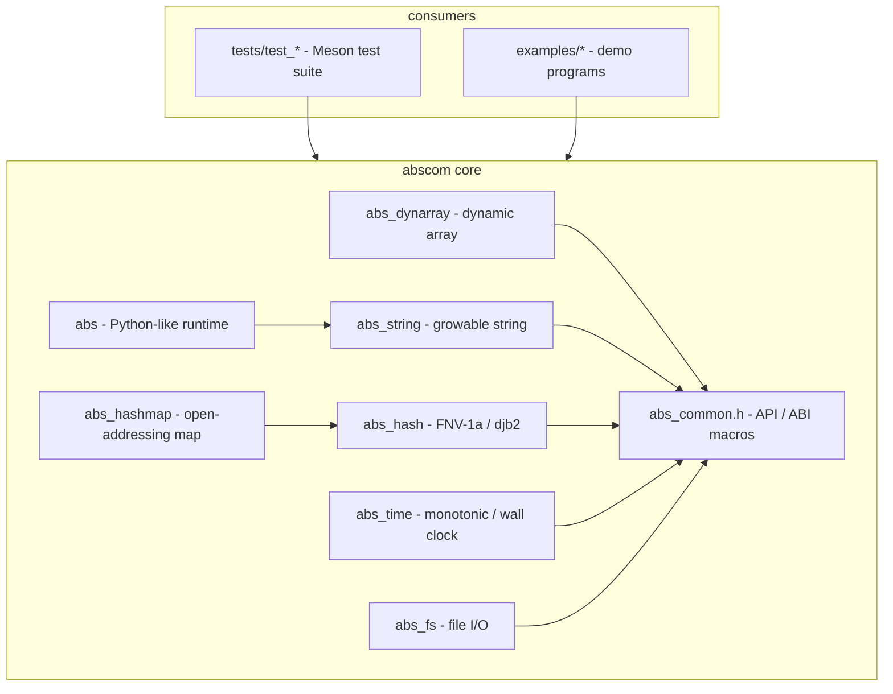

# Architecture

Abscom is a C11 library split into a core module set and a Python-like runtime. Everything is compiled into a single library by Meson.

## Repository layout

```
Abscom/
├── include/abscom/       # Public headers
│   ├── abs.h              # Umbrella header (core modules + runtime)
│   ├── abs_common.h       # ABS_API, extern "C", ABS_UNUSED
│   ├── abs_dynarray.h     # Dynamic array
│   ├── abs_string.h       # Growable string
│   ├── abs_hash.h         # Hash functions
│   ├── abs_hashmap.h      # String-keyed hash map
│   ├── abs_time.h         # Time helpers
│   └── abs_fs.h           # File I/O
├── src/                  # Implementations
│   ├── abs_dynarray.c
│   ├── abs_string.c
│   ├── abs_hash.c
│   ├── abs_hashmap.c
│   ├── abs_time.c
│   ├── abs_fs.c
│   └── abs.c
├── tests/                # Meson test suite (test_*.c)
├── examples/             # Demo programs (demo, py_demo, data_demo, v6_demo)
├── docs/                 # Documentation
├── tools/                # Dev tooling (generate_screenshots.py)
├── build.sh / build.ps1  # Local build/test/install wrappers
├── installer.sh / installer.ps1  # One-line installers
├── logo/                 # Project logo (logo.svg)
└── Screenshots/          # Screenshots (see docs/screenshots.md)
```

## Module overview



## Core modules

- **`abs_common.h`** — defines `ABS_API` (DLL export/import on Windows, default visibility on GCC/Clang), `ABS_BEGIN_C_DECLS`/`ABS_END_C_DECLS` for C++ interoperability, and `ABS_UNUSED`. Every other header includes it.
- **`abs_dynarray`** — a generic (byte-memory) dynamic array. Callers provide `elem_size`; growth doubles capacity (`push` starts at 8).
- **`abs_string`** — a NUL-terminated growable string with `append_*` variants, `append_fmt`, `set_cstr`, and `take` (ownership transfer).
- **`abs_hash`** — FNV-1a 32/64 and djb2. `abs_hashmap` depends on FNV-1a 64 for string keys.
- **`abs_hashmap`** — open-addressing map with linear probing, tombstone deletion, and automatic resizing when load exceeds 70%. `abs_hashmap_free_fn` optionally frees values.
- **`abs_time`** — wraps `QueryPerformanceCounter`/`GetSystemTimeAsFileTime` on Windows and `clock_gettime` on POSIX behind four simple functions.
- **`abs_fs`** — thin wrappers around `fopen`/`remove`/`rename`.

## The dynamic runtime

The runtime sits on top of `abs_string` and the platform code. Its key design points:

- **Object model** — `AbsObj` is a tagged union (`AbsType` + value union). Pointers are pooled: `abs.c` uses a block allocator (`POOL_BLOCK_SIZE` objects per `MemBlock`) for most objects, so allocating is cheap.
- **Memory management** — objects with heap internals (strings, lists, dicts, sets, errors, classes, files) are tracked on a `gc_dynamic_head` list; `abs_cleanup` frees internals and then the pool blocks. `del()` frees an object's internals and marks it `ABS_NONE`.
- **Literal macro** — `v(X)` dispatches on the C type via `_Generic` to the right `abs_new_*` constructor.
- **Containers** — lists and sets share a `{items, size, capacity}` struct; dicts use bucket chains (`DictNode`) with a djb2-style `dict_hash`.
- **Functional layer** — `map_func`/`filter_func` take `AbsFunc` callbacks; `list_comp` takes a `AbsMapFunc` and a bool-returning `AbsFilterFunc`.
- **JSON** — `json_parse` is a small recursive-descent parser over the pooled object model; `json_dump` serializes recursively with string escaping.
- **Networking** — `http_get` performs a blocking HTTP/1.0 GET over a raw socket (Winsock on Windows, BSD sockets on POSIX), reading until the peer closes the connection and returning the response body after `\r\n\r\n`.

## Build system

`meson.build` declares one `project`, builds the sources with `both_libraries` (static + shared), links `ws2_32` on Windows, and installs the core headers under `include/abscom`. `tests/meson.build` registers every `test_*.c` as a Meson test; `examples/meson.build` builds the demo executables.

## Lifecycle

1. `abs_init()` seeds the RNG and, on Windows, calls `WSAStartup`.
2. The program uses the runtime (or core modules directly).
3. `abs_cleanup()` frees dynamic internals, all pool blocks, and calls `WSACleanup` on Windows.

See the [core library](common-macros.md) and [runtime](lifecycle.md) topic pages for the full reference, and [getting-started.md](getting-started.md) for a first program.

Back to [README](https://github.com/rkriad585/Abscom/blob/main/README.md).
