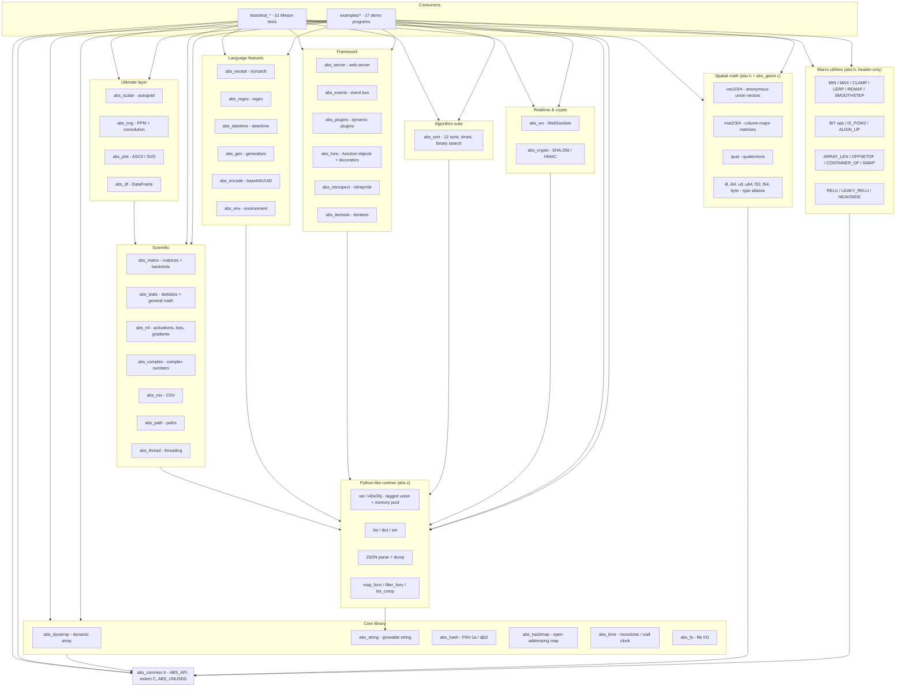

# Architecture

Abscom is a single, zero-dependency C11 library: a small core module set, a Python-inspired dynamic runtime, and a stack of higher-level layers (scientific, AI/ML, data science, ultimate, spatial math, language features, framework, algorithms, realtime and crypto) on top. Everything is compiled into one static and one shared library by Meson, and the entire public API is exposed through the umbrella header `abscom/abs.h`.

## Repository layout

```
Abscom/
├── include/abscom/       # Public headers
│   ├── abs.h              # Umbrella header (whole library)
│   ├── abs_common.h       # ABS_API, extern "C", ABS_UNUSED
│   ├── abs_dynarray.h     # Dynamic array
│   ├── abs_string.h       # Growable string
│   ├── abs_hash.h         # Hash functions
│   ├── abs_hashmap.h      # String-keyed hash map
│   ├── abs_time.h         # Time helpers
│   └── abs_fs.h           # File I/O
├── src/                  # Implementations (one file per module)
│   ├── abs.c              # Python-like runtime (var, list, dict, set, JSON...)
│   ├── abs_matrix.c       # Matrices, backends, data-science helpers
│   ├── abs_stats.c        # Statistics, general math
│   ├── abs_ml.c           # Activations, loss, gradients, preprocessing
│   ├── abs_complex.c      # Complex numbers
│   ├── abs_csv.c          # CSV read/write
│   ├── abs_path.c         # Path helpers
│   ├── abs_thread.c       # Threading
│   ├── abs_scalar.c       # Scalar autograd engine
│   ├── abs_img.c          # PPM image I/O + convolution
│   ├── abs_plot.c         # ASCII / SVG plotting
│   ├── abs_df.c           # Mixed-type DataFrame
│   ├── abs_geom.c         # Vector / matrix / quaternion ops
│   ├── abs_except.c       # try/catch exceptions
│   ├── abs_regex.c        # Regex engine
│   ├── abs_datetime.c     # datetime + timedelta
│   ├── abs_gen.c          # Generators
│   ├── abs_encode.c       # base64 + UUID
│   ├── abs_env.c          # Environment variables
│   ├── abs_server.c       # Micro web server
│   ├── abs_events.c       # Event bus
│   ├── abs_plugins.c      # Dynamic library loading
│   ├── abs_func.c         # Function objects, decorators
│   ├── abs_introspect.c   # id / repr / dir
│   ├── abs_itertools.c    # chain / cycle / repeat iterators
│   ├── abs_sort.c         # Twelve sorting algorithms + timeit
│   ├── abs_ws.c           # RFC 6455 WebSockets
│   ├── abs_crypto.c       # SHA-256 / HMAC
│   └── ...                # core modules (abs_dynarray, abs_string, ...)
├── tests/                # Meson test suite (31 test_*.c programs)
├── examples/             # Demo programs (17 total, one per layer + more)
├── docs/                 # Documentation (mkdocs + MkDocs Material)
├── tools/                # Dev tooling (generate_screenshots.py)
├── build.sh / build.ps1  # Local build/test/install wrappers
├── installer.sh / installer.ps1  # One-line installers
├── logo/                 # Project logo (logo.svg)
└── Screenshots/          # Screenshots (see docs/screenshots.md)
```

## Module overview



## Core library

- **`abs_common.h`** — defines `ABS_API` (DLL export/import on Windows, default visibility on GCC/Clang), `ABS_BEGIN_C_DECLS`/`ABS_END_C_DECLS` for C++ interoperability, and `ABS_UNUSED`. Every other header includes it.
- **`abs_dynarray`** — a generic (byte-memory) dynamic array. Callers provide `elem_size`; growth doubles capacity (`push` starts at 8).
- **`abs_string`** — a NUL-terminated growable string with `append_*` variants, `append_fmt`, `set_cstr`, and `take` (ownership transfer).
- **`abs_hash`** — FNV-1a 32/64 and djb2. `abs_hashmap` depends on FNV-1a 64 for string keys.
- **`abs_hashmap`** — open-addressing map with linear probing, tombstone deletion, and automatic resizing when load exceeds 70%. `abs_hashmap_free_fn` optionally frees values.
- **`abs_time`** — wraps `QueryPerformanceCounter`/`GetSystemTimeAsFileTime` on Windows and `clock_gettime` on POSIX behind four simple functions.
- **`abs_fs`** — thin wrappers around `fopen`/`remove`/`rename`.

See [common-macros.md](common-macros.md), [dynamic-arrays.md](dynamic-arrays.md), [strings.md](strings.md), [hashing.md](hashing.md), [hash-maps.md](hash-maps.md), [time.md](time.md), and [file-io.md](file-io.md).

## Header-only utilities

Two families live entirely in `abs.h` with no `.c` file of their own:

- **Spatial math types** — modern fixed-width aliases (`i8`…`i64`, `u8`…`u64`, `f32`/`f64`, `byte`), anonymous-union vectors (`vec2`/`vec3`/`vec4`, `ivec*`, `vec*d`, overlapping `x/y/z`, `u/v`, `r/g/b/a`, and `raw[]`), column-major `mat2`/`mat3`/`mat4`, and `quat`. The structs and their static inline constructors are in the header; the operations live in `abs_geom.c`. All are plain value types — no allocation, no `free`. See [spatial-math.md](spatial-math.md).
- **Macro utilities** — a suite of defensive-parenthesized macros for arithmetic and comparison (`ABS_MIN`/`MAX`/`MIN4`/`MAX4`, `ABS_CLAMP`, `ABS_IN_RANGE`, ...), interpolation and shading curves (`ABS_LERP`, `ABS_UNLERP`, `ABS_REMAP`, `ABS_STEP`, `ABS_SMOOTHSTEP`), angle conversion, array/struct introspection (`ABS_ARRAY_LEN`, `ABS_OFFSETOF`, `ABS_CONTAINER_OF`), generic `ABS_SWAP`, bitwise/alignment helpers, and AI activation macros, plus guard-checked unprefixed aliases. See [macros.md](macros.md).

## The dynamic runtime

The runtime sits on top of `abs_string` and the platform code. Its key design points:

- **Object model** — `AbsObj` is a tagged union (`AbsType` + value union). Pointers are pooled: `abs.c` uses a block allocator (`POOL_BLOCK_SIZE` objects per `MemBlock`) for most objects, so allocating is cheap.
- **Memory management** — objects with heap internals (strings, lists, dicts, sets, errors, classes, files) are tracked on a `gc_dynamic_head` list; `abs_cleanup` frees internals and then the pool blocks. `del()` frees an object's internals and marks it `ABS_NONE`.
- **Literal macro** — `v(X)` dispatches on the C type via `_Generic` to the right `abs_new_*` constructor.
- **Containers** — lists and sets share a `{items, size, capacity}` struct; dicts use bucket chains (`DictNode`) with a djb2-style `dict_hash`.
- **Functional layer** — `map_func`/`filter_func` take `AbsFunc` callbacks; `list_comp` takes a `AbsMapFunc` and a bool-returning `AbsFilterFunc`.
- **JSON** — `json_parse` is a small recursive-descent parser over the pooled object model; `json_dump` serializes recursively with string escaping.
- **Networking** — `http_get` performs a blocking HTTP/1.0 GET over a raw socket (Winsock on Windows, BSD sockets on POSIX), reading until the peer closes the connection and returning the response body after `\r\n\r\n`.

See [lifecycle.md](lifecycle.md) and the other runtime pages under the Runtime nav section.

## Scientific, AI/ML, and ultimate layers

These layers add numeric computing on top of the runtime's `var` matrices and a set of plain heap types:

- **`abs_matrix`** — `var`-based matrices (rows of `var` lists) with arithmetic, reductions, and a computational backend dispatcher (`AbsBackend`: `ABS_CPU`, `ABS_CPU_AVX`, `ABS_GPU_CUDA`). `abs_matrix_mul` selects an AVX kernel under `-mavx` or a CUDA simulation stub, falling back to the scalar kernel otherwise.
- **`abs_stats`** — statistics (`abs_stats_mean`/`median`/`variance`/`stdev`), general math (scalar utilities, number theory, geometry, root finding, raw-array statistics).
- **`abs_ml`** — activations and derivatives, softmax, MSE loss, accuracy, numerical gradients, plus data-science preprocessing (`abs_matrix_one_hot_encode`, `abs_matrix_train_test_split`).
- **`abs_complex`** — a plain-value `AbsComplex` type with add/sub/mul, magnitude, conjugate, and print.
- **`abs_csv`**, **`abs_path`**, **`abs_thread`** — CSV read/write, path helpers, and a threading wrapper with a lock-guarded pool.
- **Data science additions in `abs_matrix.c`** — NumPy-style reshape/flatten/slice/vstack/hstack, generators (ones/arange/linspace), Pandas-style numeric CSV, and functional utils.
- **`abs_scalar`** — a Micrograd-style autograd engine of `double` scalars. Nodes form a DAG that may share subtrees; `abs_scalar_backward` runs reverse-mode differentiation over a reverse topological order, and `abs_scalar_free` collects the unique reachable nodes before releasing them (so shared subtrees are freed exactly once — a per-node guard flag would read freed memory).
- **`abs_img`** — PPM loading/saving and 2D convolution on an `AbsImg` type.
- **`abs_plot`** — terminal ASCII charts and SVG line-chart export.
- **`abs_df`** — a mixed-type DataFrame (`AbsDF`) with double/string columns.

See [scientific.md](scientific.md), [ml.md](ml.md), [general-math.md](general-math.md), [data-science.md](data-science.md), and [ultimate.md](ultimate.md).

## Language features

Small self-contained modules on top of the runtime: `try`/`catch` exceptions over a `setjmp`/`longjmp` env stack (`abs_except`), a regex engine (`abs_regex`), date/time (`abs_datetime`), lazy generators (`abs_gen`), base64/UUID (`abs_encode`), and environment-variable helpers (`abs_env`). See [exceptions.md](exceptions.md), [regex.md](regex.md), [datetime.md](datetime.md), [generators.md](generators.md), and [encoding-and-env.md](encoding-and-env.md).

## Framework layer

A micro HTTP server (`abs_server`), a publish/subscribe event bus (`abs_events`), dynamic library loading (`abs_plugins`), function objects with memoization and target-aware decorators (`abs_func`), introspection (`abs_introspect`), and itertools-style iterators (`abs_itertools`). See [web-server.md](web-server.md), [events.md](events.md), [plugins.md](plugins.md), [functions.md](functions.md), [introspection.md](introspection.md), and [itertools.md](itertools.md).

## Algorithm suite

`abs_sort` implements twelve sorting algorithms over the runtime's lists (bubble → radix), a swap-hook visualizer, `timeit` benchmarking, and `binary_search`. See [sorting.md](sorting.md).

## Realtime and crypto

`abs_ws` implements the RFC 6455 WebSocket handshake and framing on a small `abs_socket` handle; `abs_crypto` implements SHA-256 and HMAC-SHA-256 from scratch. See [websockets.md](websockets.md) and [crypto.md](crypto.md).

## Build system

`meson.build` declares one project, builds all sources with `both_libraries` (static + shared), links `ws2_32` on Windows and `m`/`pthread` on POSIX, and installs the headers under `include/abscom`. `tests/meson.build` registers every `test_*.c` as a Meson test; `examples/meson.build` builds the demo executables. Equivalent builds exist via `CMakeLists.txt` and a plain `Makefile`. Sanitizer runs are supported with `meson setup build-sanitize -Db_sanitize=address,undefined`.

## Lifecycle

1. `abs_init()` seeds the RNG and, on Windows, calls `WSAStartup`.
2. The program uses the runtime, the layers, or the core modules directly. Plain-value types (`AbsComplex`, `AbsScalar`, vectors, matrices) need no initialization.
3. `abs_cleanup()` frees dynamic internals, all pool blocks, and calls `WSACleanup` on Windows.

See the [core library](common-macros.md) and [runtime](lifecycle.md) topic pages for the full reference, and [getting-started.md](getting-started.md) for a first program.

Back to [README](https://github.com/rkriad585/Abscom/blob/main/README.md).
